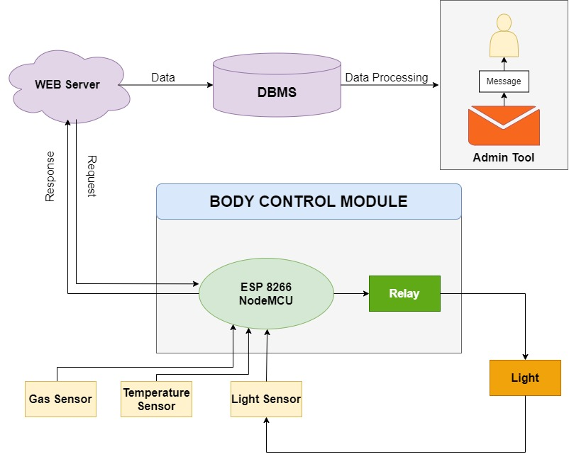
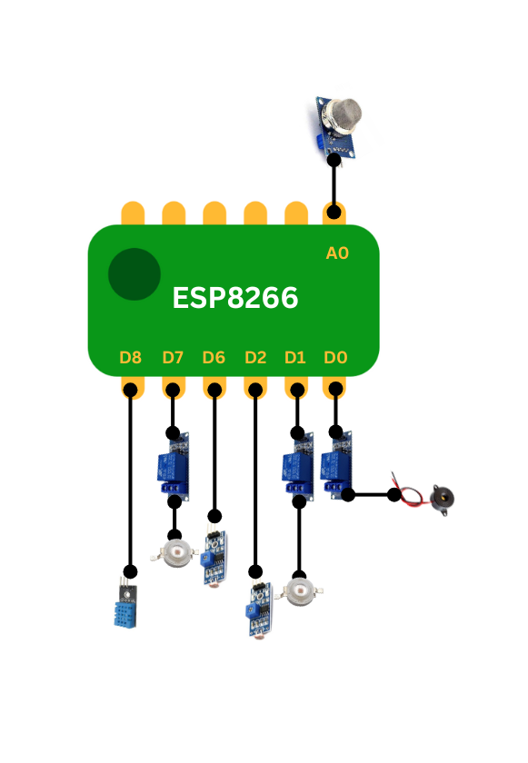

<h1>
  
  
Smart Home Control and Monitoring System

</h1>

## Table of Contents
- [Table of Contents](#table-of-contents)
- [Architectural Design](#architectural-design)
- [Library Installation](#library-installation)

## Architectural Design
The system architecture is designed to facilitate automated control and monitoring through an integration of sensors, a central controller, and a web server with a database management system. The architecture is divided into two main parts:

<h1>
  
</h1>

## 1. Central Controller and Sensors
The **central controller** module is built around the **ESP8266 NodeMCU** microcontroller, which functions as the main processing unit. The module includes the following components:

- **Gas Sensor**: Detects the presence of gas or potential leakage.
- **Temperature Sensor**: Monitors the ambient temperature.
- **Light Sensor**: Measures ambient light levels.

These sensors continuously collect data, which is then processed by the NodeMCU to make decisions based on predefined conditions. The NodeMCU also controls a **Relay Module** that can switch an external **Light** on or off based on sensor readings and commands from the web server.

<h1>
  
</h1>

## 2. WEB Server and Database
The **WEB Server** facilitates communication between the NodeMCU and the **Database Management System (DBMS)**:

- **Data Transmission**: The sensors' data is sent to the DBMS, where it is stored for further processing and analysis.
- **Admin Tool**: An interface connected to the database that allows an administrator to process and review the stored data. This tool can send messages or alerts based on the data analysis.
- **Request and Response Handling**: The web server manages **Request** and **Response** interactions with the NodeMCU, enabling remote monitoring and control via web-based interfaces or applications.

For WebServer, kindly refer this tutorial: https://randomnerdtutorials.com/esp32-esp8266-mysql-database-php/

Web UI:
<h1>
  
</h1>

Admin Tool:
<h1>
  
</h1>

## Library Installation
Firstly, you need to install the tools for writing source code. This project requires two software programs: **Arduino IDE** and **Visual Studio Code**.

After installing Arduino IDE, proceed to install the necessary libraries. Go to **Sketch => Include Library => Manage Libraries** and install the following libraries:

- `ESP8266WiFi.h`
- `WiFiClient.h`
- `ESP8266WebServer.h`
- `ESP8266mDNS.h`
- `ESP8266HTTPClient.h`
- `DHT.h` (esp826611 by AMD16)

Next, you need to install libraries for Python programming. Install them using the command `pip install **library**`.

The libraries to install are:

- `tkinter`
- `pandas`
- `pillow`
- `smtp`
- `email`

